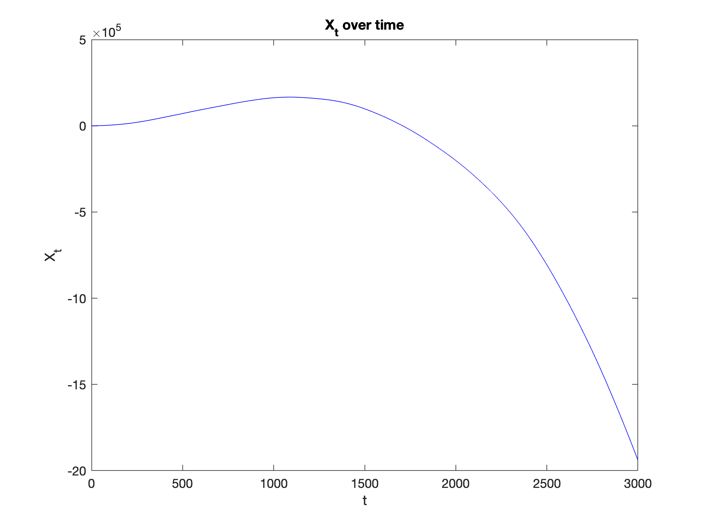
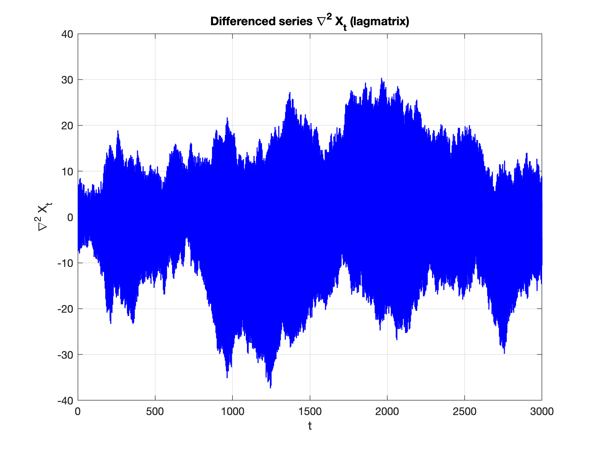
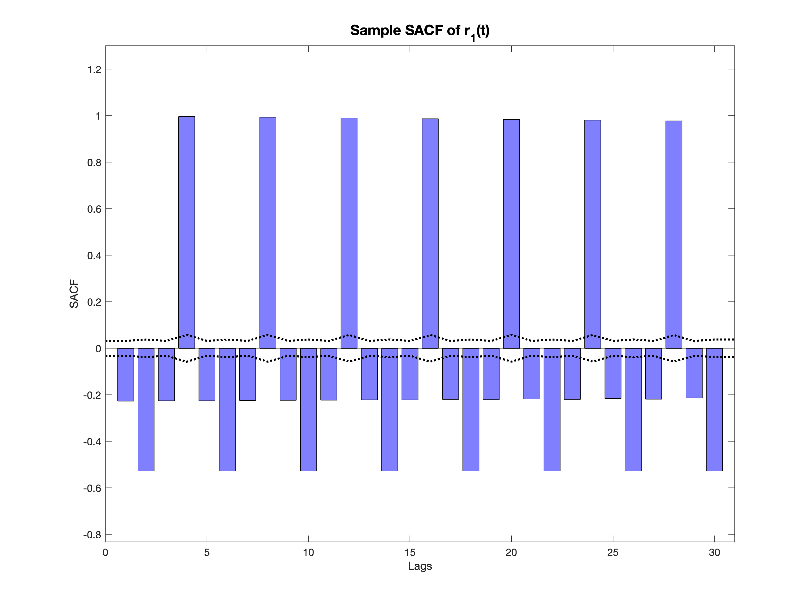
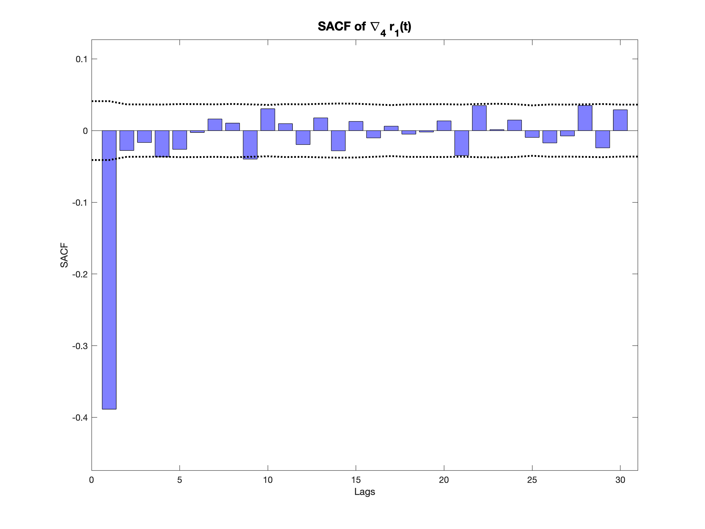
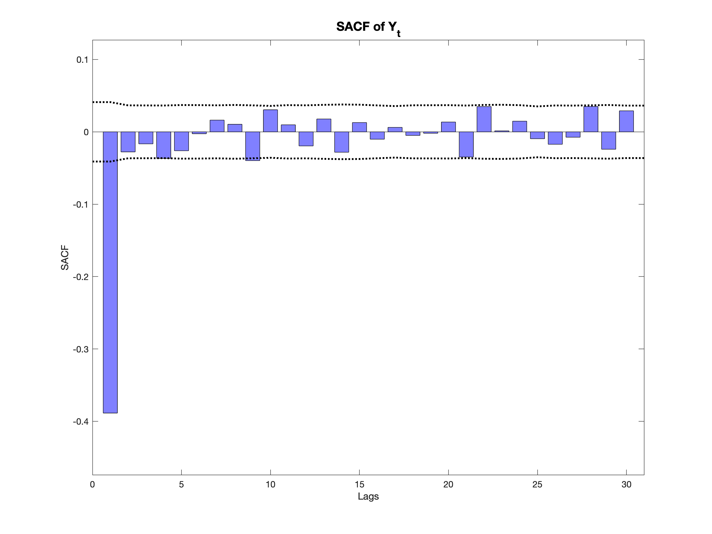
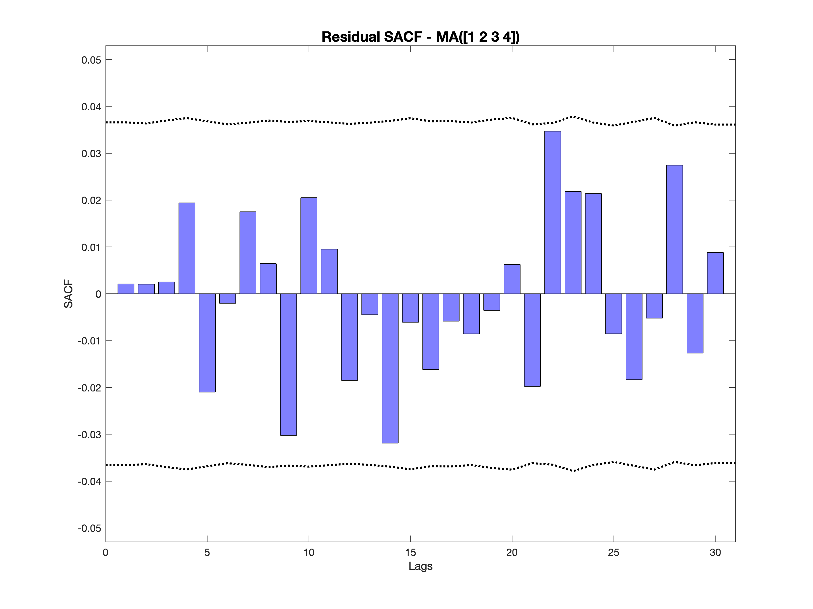
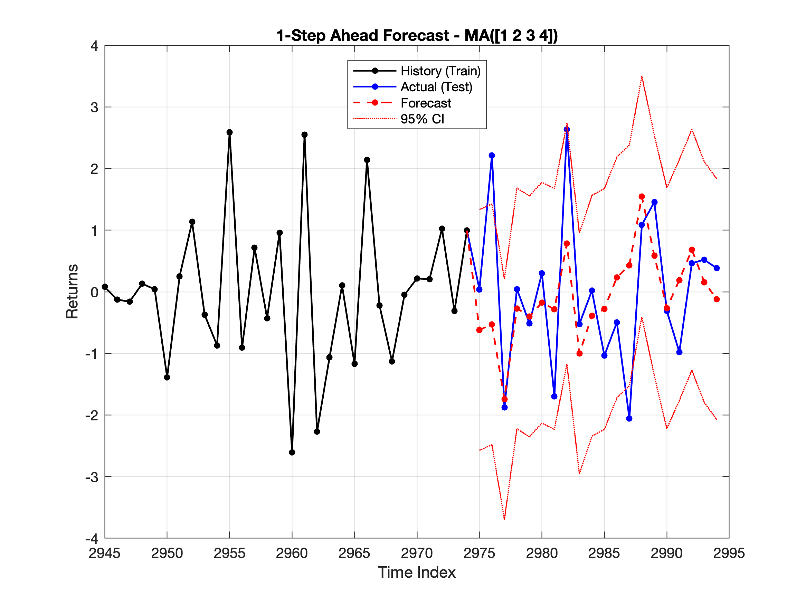
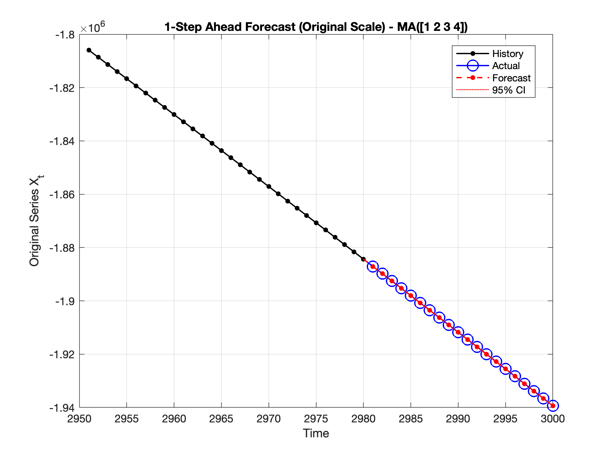

# Stock Price Time-Series Modeling

From transformed daily stock prices to a validated `MA(1,2,3,4)` forecasting model for financial risk analysis.

## Project Overview

This project solves a hedge fund risk-analysis case study focused on modeling the transformed daily closing prices of a stock in a portfolio. Financial returns are not always purely random: they can exhibit predictable structures that matter for hedging decisions and future-loss prevention.

The analysis uses a traditional additive decomposition:

$$
X_t = m_t + s_t + Y_t
$$

where $m_t$ is the deterministic trend, $s_t$ is the seasonal component, and $Y_t$ is the stationary stochastic component.

The workflow follows a Box-Jenkins-style approach: remove trend and seasonality, test whether the remaining process is stationary or purely random, select a parsimonious stationary model, validate its assumptions, and evaluate one-step-ahead forecasts.

The full report can be consulted in `report.pdf` for the complete methodology, assumptions, statistical tests, and interpretation.

## Repository Structure

```text
.
├── assignment.m                     # Main MATLAB analysis pipeline
├── figs/                            # Exported figures used in the report and README
├── report.pdf                       # Final report with full methodology and interpretation
├── report/                          # LaTeX source and report assets
└── M-files/                         # Dataset and supporting MATLAB/MFE Toolbox functions
```

## Results Summary

### Trend and Differencing

 

The original series exhibits a strong deterministic trend. A cubic trend is strongly supported (`R² = 0.9996`, `p < 1e-16`), but second differencing is selected because it removes the trend in practice while avoiding unnecessary over-differencing.

### Seasonality

 

The SACF reveals a seasonal structure with period `S = 4`. After seasonal differencing, the seasonal Ljung-Box test moves from strong rejection (`p < 1e-16`) to non-rejection (`p = 0.2745`).

### Stationary Model

 

The deseasonalized process is stationary but still serially dependent: the ADF test rejects the null hypothesis of a unit root, so the process can be treated as stationary (`stat = -82.39`, `p = 0`), but the Ljung–Box tests reject the null hypothesis of no autocorrelation, so the process is not white noise (`p < 1e-16`).  

We therefore fit an MA model; the selected specification is `MA(1,2,3,4)`, chosen using SACF/SPACF guidance, residual Ljung–Box diagnostics, parsimony, and the lowest BIC among the validated candidates (`BIC = 0.0115`). The final model is:

$$
Y_t = a_t - 0.5929a_{t-1} - 0.0837a_{t-2} - 0.0651a_{t-3} - 0.0856a_{t-4}
$$

Its residuals pass the Ljung–Box tests (all p-values > `0.11`), show no ARCH effects (all p-values > `0.79`), and do not reject normality using the KS test (`stat = 0.0088`, `p = 0.9751`).

### One-Step-Ahead Forecasting

 

The final model tracks the last 20 observations closely on both the stationary and original scales. Forecast accuracy is strong, with test RMSE `1.09999`, close to the training residual standard deviation `0.9969`.
